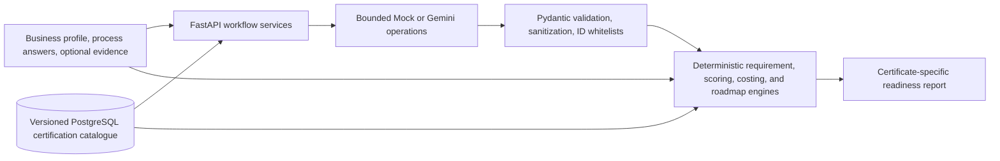

# CertifyLK

[](https://github.com/HirushaSipsara/certifylk/actions/workflows/ci.yml)

**AI-assisted, certificate-specific readiness guidance for small Sri Lankan food manufacturers.**

[Live application](https://certifylk.duckdns.org) · [Implementation status](docs/IMPLEMENTATION_PROGRESS.md) · [Architecture](docs/ARCHITECTURE.md) · [AI contract](docs/AI_BEHAVIOR.md) · [API contract](docs/API_CONTRACT.md)

CertifyLK helps a manufacturer answer three practical questions:

1. **Which certification pathway is relevant to my business and target market?**
2. **What does that specific certificate expect, and what have I already implemented?**
3. **Which gaps should I address first, and what could the preparation work cost?**

The application combines a versioned PostgreSQL certification catalogue, bounded Gemini reasoning, optional image/PDF evidence analysis, and deterministic scoring, costing, and roadmap engines. AI makes the experience easier to understand and faster to complete; reviewed data and deterministic code remain the authority for every score, legal tier, requirement, and cost.

> **Important:** CertifyLK is an educational preparation tool. It does not issue certificates, perform an official audit, give legal advice, guarantee certification, or replace SLSI, another certification body, a regulator, or an accredited laboratory. Catalogue content marked as unverified must be confirmed with the named authority.

## Why this is a strong AI use case

CertifyLK does not add a generic chatbot to a form. It uses AI only where interpretation of business context or unstructured evidence creates real user value, while deterministic engines retain control of compliance-sensitive decisions.

| AI contribution | What it does | User impact | Safety boundary |
|---|---|---|---|
| **Decision-making** | Ranks database-supplied certification candidates from the product, business profile, existing registrations, scale, and target market, then explains the recommended path. | Replaces a confusing certification decision tree with a clear, business-specific starting point. | AI can select only supplied scheme IDs. Legal tiers and applicability facts come from the catalogue and are validated by the backend. |
| **Detection from evidence** | Inspects the actual bytes and MIME type of an uploaded image or PDF and returns a requirement-bound `supports`, `concern`, or `unclear` observation with confidence. | Turns photos, records, and documents into a reviewable evidence summary without pretending to be an official inspection. | Every observation must match the selected scheme, evidence request, and allowed requirement ID. AI cannot declare certification, invent a clause, or create a laboratory result. |
| **Process automation** | Converts free-text manufacturing steps into a structured sequence using approved process tags. | Reduces manual data entry and makes process information usable by the assessment workflow. | All non-empty source steps must be represented once, and only approved tags are accepted. |
| **Assessment optimization** | Selects approved adaptive and clarification questions for unresolved areas. | Avoids asking every possible question and focuses the user on missing information. | The model can return only question IDs supplied for that exact assessment. |
| **Explanation automation** | Rewrites an already calculated roadmap into clear, practical language. | Makes technical preparation actions and their order easier for a small manufacturer to understand. | AI cannot change actions, priorities, costs, score gains, projections, or source references. |

CertifyLK intentionally does **not** predict a probability of certification. A model confidence value describes the quality of an evidence observation, not the likelihood of passing an audit.

## AI features working today

All AI operations use the same typed `AIProvider` interface and work with deterministic Mock AI or Gemini:

- `plan_applicable_schemes` — produces a ranked, explainable certification-path decision over bounded catalogue candidates.
- `plan_adaptive_questions` — chooses approved process questions relevant to the saved profile.
- `extract_process` — normalizes submitted manufacturing steps into approved structured stages and tags.
- `analyze_evidence` — analyzes real JPEG, PNG, WebP, or PDF content against one database requirement at a time.
- `plan_clarifications` — chooses approved follow-up questions for unresolved requirements.
- `explain_roadmap` — explains deterministic roadmap items without changing their order or values.

Every model response is treated as untrusted until Pydantic validation, text sanitization, and request-specific ID whitelist checks pass. `ai_runs` records the exact provider, model, latency, success, and fallback status without storing API keys, prompts, raw uploads, or full model responses.

The UI displays **Analyzed by Gemini**, **Completed using fallback analysis**, or a development/QA Mock label only when the API confirms that state for the exact operation. Production AI mode is deployment-controlled, so the visible provider metadata and matching `ai_runs` record are the source of truth for a live demo.

### Reliable hybrid evidence flow

Evidence analysis is useful but is not allowed to block the core assessment:

- Each requirement has a controlled current-state answer: **Yes**, **Partially**, **No**, or **Not sure**.
- Supporting image/PDF upload is optional; a user can remove and re-upload a file before continuing.
- Self-reported readiness and evidence completeness remain separate.
- Gemini reviews one file per bounded call using the actual stored file bytes and database requirement context.
- A clear observation may support or challenge a self-report; an ambiguous item remains `unclear`.
- If Gemini times out or fails, the upload stays saved, no positive observation is fabricated, and the user can continue with a controlled message.
- Successful observations are preserved even if another file cannot be analyzed.

This design keeps the live demonstration reliable while still showing meaningful multimodal AI detection when the provider is available.

## Current user journey

### Track 1 — Product Quality

```text
Home
  → Product Quality
  → Food Products / Fresh Fruit Cordial
  → Business profile
  → AI-ranked applicable certification pathways
  → SLS Mark certificate selection
  → Certificate Assessment Hub and requirement overview
  → Production process and adaptive questions
  → Requirement self-assessment and optional evidence uploads
  → AI evidence review and targeted clarifications
  → Readiness report, evidence completeness, costs, and action roadmap
```

Track 1 includes relevant Sri Lankan food-registration guidance. If a user reports that a registration is already held, the backend acknowledges it separately instead of asking AI to recommend obtaining it again.

### Track 2 — Process & System

```text
Home
  → Process & System
  → Business profile
  → AI-ranked SLS GMP / SLS HACCP / ISO 22000:2018 pathways
  → Selected certificate's Assessment Hub
  → The same certificate-scoped process, evidence, clarification, and result journey
```

The selected certificate remains visible throughout the assessment and on the final readiness report.

### Result contract

The report keeps two different measurements explicit:

- **Readiness Indicator** — deterministic preparation readiness derived from supported profile answers, process answers, controlled requirement self-assessments, clarifications, and accepted evidence.
- **Evidence Completeness** — the share of applicable requirements supported by accepted uploaded-evidence observations.

The result also shows category readiness, confirmed strengths, gaps/partial requirements, unknown items, categorized LKR cost estimates, prioritized actions, expected improvement, source/verification warnings, and a print/PDF view. Unknown information is not silently converted into a gap or a strength.

## What is implemented

- Two authorized certificate-specific tracks with guest UUID assessments.
- Database-backed categories, products, certification bodies, source documents, schemes, requirements, evidence expectations, category weights, and cost items.
- Fresh Fruit Cordial / SLS Mark pilot catalogue plus SLS GMP, SLS HACCP, and ISO 22000:2018 Track 2 catalogue entries.
- Assessment Hub, selected-scheme requirement browser, process capture, hybrid evidence stage, clarification, result, cost breakdown, and roadmap.
- Optional JPEG/PNG/WebP/PDF upload through a `StorageProvider`, including remove and re-upload behavior.
- Accessible evidence polarity labels and confidence bands; color is never the only signal.
- Guest assessment recovery at `/my-assessments`, an education page, a canonical Fresh Fruit Cordial sample, and print/PDF reporting.
- FastAPI/OpenAPI backend, strict Next.js frontend, PostgreSQL/Alembic migrations, and deterministic Mock AI test mode.
- GitHub Actions quality gates, immutable commit-SHA container images, AWS OIDC/SSM deployment, Nginx HTTPS, persistent volumes, health checks, backups, and rollback scripts.

See [Implementation progress](docs/IMPLEMENTATION_PROGRESS.md) for the precise implemented/partial/not-implemented boundary.

## How the system stays explainable



The separation is deliberate:

- **PostgreSQL defines facts:** schemes, requirements, sources, legal/market tiers, weights, and costs.
- **AI interprets bounded context:** relevance, unstructured process descriptions, evidence observations, and plain-language explanations.
- **Deterministic engines decide numbers:** requirement status rules, category normalization, readiness, evidence completeness, cost totals, priorities, gains, and projections.
- **The UI exposes provenance:** selected certificate, content-verification state, provider/fallback status, self-reported versus evidence-supported information, and the certification-readiness disclaimer.

## Technology

- **Frontend:** Next.js 15 App Router, React 19, strict TypeScript, Tailwind CSS, React Hook Form, Zod
- **Backend:** FastAPI, Pydantic v2, SQLAlchemy 2, Alembic, PostgreSQL
- **AI:** Gemini structured output plus deterministic Mock provider behind `AIProvider`
- **Testing:** Pytest, Ruff, mypy, Vitest, Testing Library, Playwright
- **Delivery:** Docker Compose, Nginx, GitHub Actions, GHCR, AWS EC2, IAM/OIDC, Systems Manager, Terraform

## Local development

### Prerequisites

- Python 3.10+
- Node.js 20+
- Docker Desktop / Docker Compose
- Optional: GNU Make

### Start the application

PowerShell:

```powershell
Copy-Item backend\.env.example backend\.env
Copy-Item frontend\.env.example frontend\.env.local

$env:CERTIFYLK_POSTGRES_PORT = "55432"
docker compose -f infra/local/docker-compose.yml up -d

python -m pip install -e ".\backend[dev]"
Push-Location backend
python -m alembic upgrade head
Pop-Location
python scripts/seed_demo_data.py

# Terminal 1
Push-Location backend
python -m uvicorn app.main:app --reload --port 8000

# Terminal 2, from the repository root
Set-Location frontend
npm install
npm run dev
```

Open <http://localhost:3000>. OpenAPI documentation is at <http://localhost:8000/docs>.

Equivalent Make targets:

```bash
make db-up
make install
make migrate
make seed
make backend-dev
# another terminal
make frontend-dev
```

Detailed Windows, Bash, environment, and troubleshooting instructions are in [Local development](docs/LOCAL_DEVELOPMENT.md).

## AI configuration

Deterministic local/test mode requires no Gemini key:

```env
AI_PROVIDER=mock
ALLOW_AI_FALLBACK=true
```

Gemini is configured only in the backend environment:

```env
AI_PROVIDER=gemini
GEMINI_API_KEY=replace_with_backend_only_key
GEMINI_MODEL=gemini-3.6-flash
ALLOW_AI_FALLBACK=true
EVIDENCE_AI_TIMEOUT_SECONDS=8
EVIDENCE_AI_TOTAL_TIMEOUT_SECONDS=20
```

Use `python scripts/check_gemini.py` from the repository root to test structured Gemini connectivity. Never expose the key through a `NEXT_PUBLIC_*` variable, commit it, print it in logs, or add it to screenshots.

## Quality gates

Run the repository-equivalent gate:

```bash
make check
```

The complete browser path is separate:

```bash
cd frontend
npm run test:e2e
```

CI runs backend formatting/lint/type/tests, frontend lint/type/unit/build checks, PostgreSQL migration and Mock-AI browser paths, Terraform validation, and production container builds. No production deployment should proceed unless its required checks pass.

## Precise next improvements

The remaining work is primarily **content authority, field validation, and operational hardening**, not another product redesign.

### P0 — Trustworthy certification content

1. Lawfully obtain and review the applicable Fresh Fruit Cordial/SLS specification, current SLS Mark procedure, Food Act/labelling material, SLS GMP/HACCP guidance, and licensed ISO 22000:2018 material.
2. Have a qualified domain reviewer validate every requirement, evidence expectation, evaluation mapping, applicability tier, clause/source reference, and cost item.
3. Keep `content_verified=false` and the visible draft warning until that review is complete.
4. Replace hand-maintained seed content with reviewed, version-controlled YAML/JSON/CSV imports, including effective and retired dates and a reviewer/change record.

### P1 — Validate the product in the field

1. Run the documented pilot with 2–3 representative Fresh Fruit Cordial manufacturers and qualified reviewers.
2. Compare CertifyLK outputs with reviewer findings, record discrepancies and severity, and update only reviewed catalogue data or deterministic mappings.
3. Complete privacy, consent, retention, and evidence-deletion review before accepting real production documents in a pilot.
4. Recheck Track 2 content and flows separately for SLS GMP, SLS HACCP, and ISO 22000:2018.

### P1 — AI and operational hardening

1. Verify the configured Gemini model, network access, quota, multimodal PDF/image capability, and exact-run provider records before every public demonstration.
2. Add a richer auditable grounding trail only for references truly supplied to and used by the current AI run; do not label the current supplied-context operation as tool calling.
3. Expand ambiguity, irrelevant-evidence, prompt-injection, partial-provider-failure, and provider-observability tests with reviewed fixtures.
4. Add asynchronous per-file evidence jobs and polling only if real pilot load shows the current bounded synchronous review is insufficient.
5. Complete encrypted off-host backup verification and a production-like restore drill for the redesigned data and uploads.

### P2 — Controlled expansion

Add another product or certification scheme only after a scope decision, lawful source pack, named reviewer, requirement and cost integrity checks, deterministic sample, and full migration/API/UI tests. A reviewed import workflow should come before a broad admin UI.

Authentication, payments, official certificate applications, regulator integrations, marketplaces, generic chat, vector databases, autonomous agents, other countries, and unrelated industries remain outside the authorized scope unless a later decision explicitly approves them.

## Repository map

- `docs/` — canonical product, AI, architecture, data, API, test, security, operations, and delivery contracts.
- `backend/` — FastAPI routes, typed services, repositories, ORM models, Alembic migrations, AI adapters, and deterministic engines.
- `frontend/` — Next.js App Router UI for both tracks and the certificate-specific assessment experience.
- `infra/local/` — local PostgreSQL Compose configuration.
- `infra/production/` — production Compose, Nginx, backup, health, deployment, and rollback scripts.
- `infra/terraform/` — documented AWS single-host infrastructure.
- `.github/workflows/` — CI and immutable production deployment workflows.
- `sample-data/` — legacy chilli-paste regression fixture; the public sample is Fresh Fruit Cordial/SLS Mark.

## Documentation

- [Product requirements](docs/PRODUCT_REQUIREMENTS.md)
- [MVP and authorized scope](docs/MVP_SCOPE.md)
- [Architecture](docs/ARCHITECTURE.md)
- [AI behavior](docs/AI_BEHAVIOR.md)
- [AI integration](docs/AI_INTEGRATION.md)
- [Data model](docs/DATA_MODEL.md)
- [Scoring and costing](docs/SCORING_AND_COSTING.md)
- [API contract](docs/API_CONTRACT.md)
- [Test plan](docs/TEST_PLAN.md)
- [Full implementation plan](docs/FULL_IMPLEMENTATION_PLAN.md)
- [Production deployment](docs/PRODUCTION_DEPLOYMENT.md)

## Security

Never commit backend/frontend environment files, Gemini credentials, database passwords, AWS credentials, registry tokens, uploaded evidence, backups, Terraform state, saved plans, or TLS private keys. See [Security](docs/SECURITY.md) and [Privacy and consent](docs/PRIVACY_AND_CONSENT.md).
