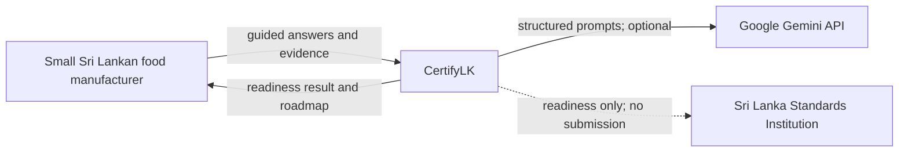
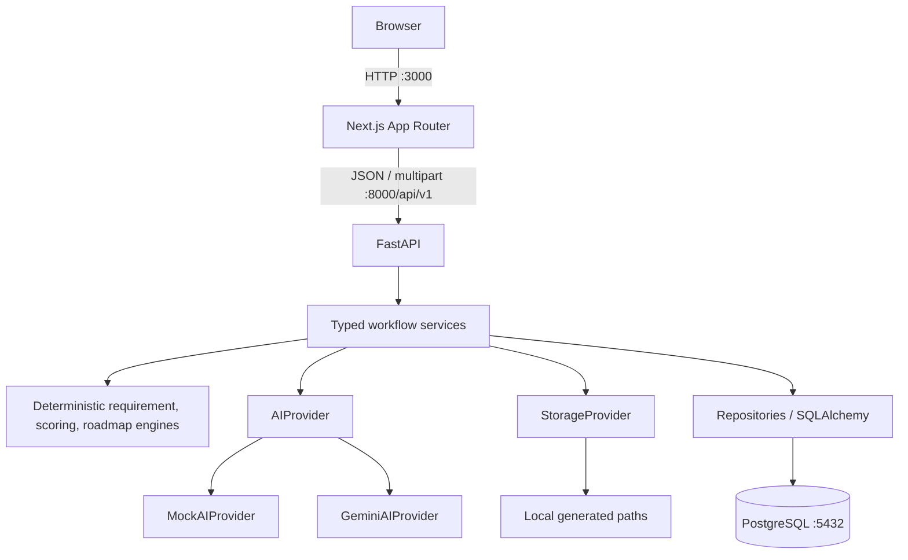
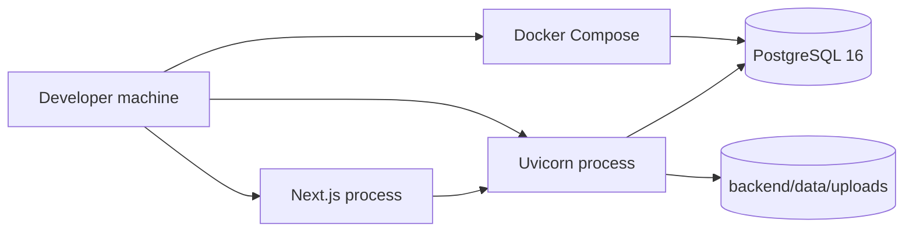
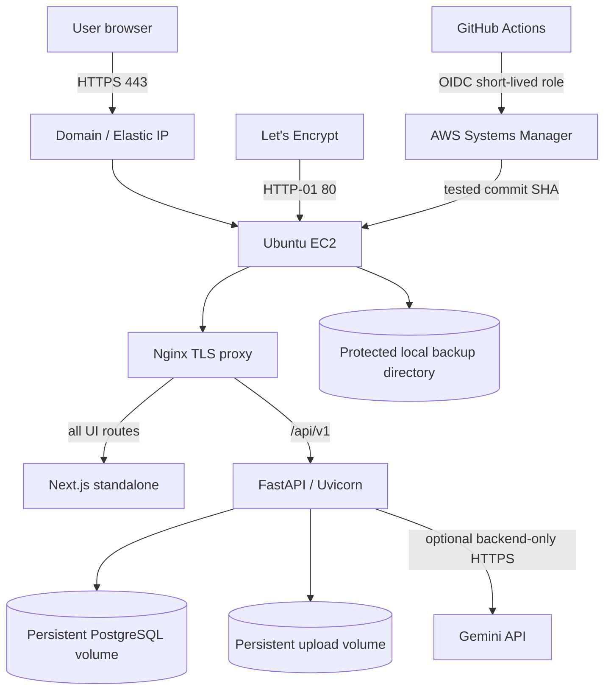
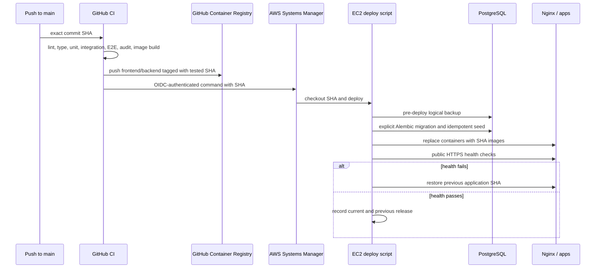

# Architecture

## System context

CertifyLK has no authentication or official SLS integration in Phase 1.

## Containers

## Page request flows

### Landing and Page 1

1. `POST /assessments` creates a UUID at `draft_profile`; the frontend stores it and opens `/profile`.
2. `PUT /profile` validates and stores profile answers, then advances to `profile_complete`.
3. `POST /adaptive-plan` creates profile-derived candidate questions, calls AI through validation/whitelisting, stores two to five questions, and returns them.
4. The frontend navigates to `/process`. Loading and API error states remain visible.

### Page 2

1. `PUT /process` requires the profile state, exactly five slots and at least three non-empty steps; it stores process/adaptive answers.
2. `POST /process-analysis` invokes `AIProvider.extract_process`, validates structured stages/tags, stores the analysis, and returns exact-run provider/fallback metadata.
3. The frontend shows a lightweight process-review state and confirmed provider label before the user continues.
4. `POST /evidence-plan` applies approved evidence types and limits (five photos, two PDFs), stores requests, advances to `evidence_pending`, and opens `/evidence`.

### Page 3

1. Multipart upload validates the request slot, MIME, extension, size, safe storage key, and slot count before storing metadata and bytes. Alternatively, `PUT /unavailable` closes a request without a file.
2. `POST /evidence-analysis` opens only stored files, sends sanitized evidence context to AI, validates and persists observations/confidence, and returns exact-run provider/fallback metadata. Missing slots become unknown evidence, not gaps.
3. The frontend pauses in a lightweight evidence-review state showing accessible polarity, unchanged confidence, and confirmed provider/fallback status.
4. `POST /clarification-plan` runs only when the user continues, builds high-priority candidates, enforces a three-to-five supplied-ID whitelist, persists them, advances to `clarification_pending`, and opens `/clarification`.

### Page 4 and result

1. `PUT /clarifications` validates answers against assigned questions and advances to `ready_to_score`.
2. `POST /complete` evaluates requirements and evidence references, calculates scores/completeness, maps/ranks catalogue actions, calculates LKR ranges and projected gains, and asks AI only for optional explanations. The transaction persists a completed result.
3. `GET /result` serializes the stored deterministic result. No provider call occurs on retrieval.

## AI adapter pattern

`AIProvider` is a protocol with five operations. `AIService` selects Mock or Gemini from backend settings, times calls, validates typed output, sanitizes free text, enforces supplied question/evidence whitelists, records `ai_runs`, retries Gemini once on invalid/transient output, and falls back only when explicitly allowed. `run_with_validation` returns a typed execution result containing the validated output plus provider/fallback metadata from the exact successful run. Mock is deterministic and exercises the same schemas. AI never changes scores, prices, or requirement rules.

## Storage provider pattern

`StorageProvider` exposes generated-key save/open/delete operations. `LocalStorageProvider` resolves keys beneath the configured upload root and rejects traversal. `S3StorageProvider` is a typed future placeholder that deliberately raises a configuration error; it contains no AWS code. Database records store the generated key, never a raw user filename.

## Local infrastructure

Only PostgreSQL is containerized in local development. These commands and ports remain independent from production.

## Production infrastructure

Nginx is the only service publishing host ports. `app` and `data` Docker networks are internal. The frontend is built with same-origin `/api/v1`, so the browser never needs an internal hostname and CORS remains restricted to the production HTTPS origin.

### Production release flow

Application rollback never deletes volumes and never automatically reverses a database migration. Migrations must be backward-compatible with the preceding image. Database/upload recovery is a separate, operator-approved restore procedure.

### Terraform provisioning boundary

`infra/terraform` provisions the same production topology: VPC, public subnet/route, HTTP/HTTPS security group, encrypted EC2/EBS, Elastic IP, EC2 SSM role, GitHub OIDC deployment role, and optional Route 53 record, budget, and GitHub environment variables. EC2 cloud-init installs host dependencies, clones a public repository, creates the backend environment in mock mode with a host-generated PostgreSQL password, and requests TLS only after DNS resolves to the instance.

Terraform does not deploy product logic and does not receive PostgreSQL, Gemini, GHCR, deploy-key, or TLS private-key secrets. Those remain protected on EC2 so they cannot be retained in Terraform state. GitHub Actions remains responsible for immutable application images, migrations, deployment, and public health gating.

## Security boundaries

- The browser is untrusted. All state transitions, assigned-question checks, file rules, and assessment ownership-by-UUID constraints are enforced server-side.
- `GEMINI_API_KEY`, database credentials, uploaded bytes, and raw extracted text remain behind FastAPI. Only `NEXT_PUBLIC_API_BASE_URL` reaches the browser.
- Uploaded content is untrusted data. It cannot change prompts, candidate IDs, requirements, costs, or tool behavior.
- Storage keys are UUID-based and path-confined; raw filenames are metadata only after control-character stripping and length limiting.
- Correlation IDs are accepted/generated and returned, but logs omit secrets and raw evidence content.
- CORS is restricted by backend environment configuration. No Phase 1 authentication means possession of a UUID allows retrieval; production treats assessment URLs as sensitive bearer links and documents this limitation.
- Production secrets exist only in protected EC2 files or short-lived OIDC sessions. The Gemini key is injected into FastAPI only; GHCR read credentials are not injected into application containers.
- Nginx terminates TLS and applies body, connection, and request-rate limits. Database, backend, and frontend ports are not exposed by the production Compose project.
- Application containers run non-root with read-only root filesystems and dropped capabilities. The narrowly scoped upload initializer is the only one-shot container that runs as root.
- Persistent PostgreSQL, uploads, TLS files, and backups reside on encrypted host storage. Backups require protected off-host copies for host-loss recovery.
