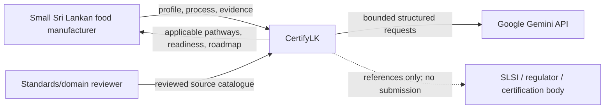
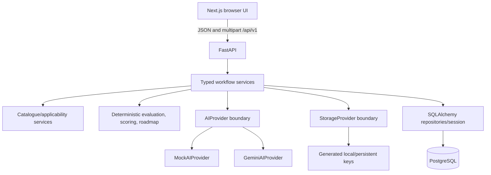
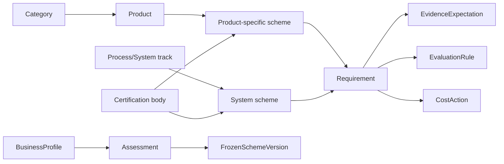
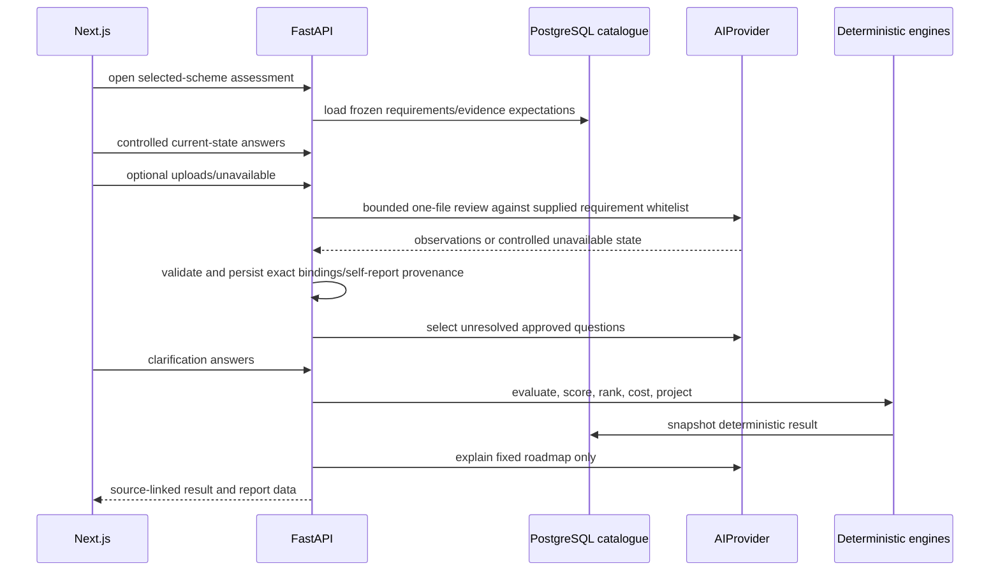
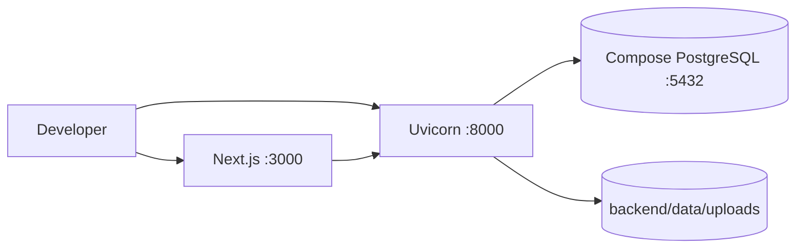
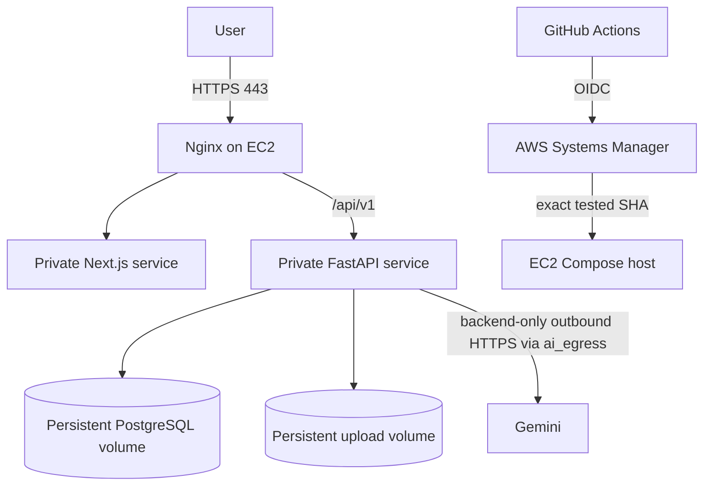

# Architecture

## Architectural state

CertifyLK is being converted in place. The certificate knowledge base and track-selection/applicability layer coexist with the original generic four-page engine. Backend completion for assessments with `scheme_id` now evaluates the selected scheme requirements/weights/cost snapshot. The remaining cutover is to make every evidence request, question, upload, and frontend journey derive from the assessment’s frozen certification scheme/version. Until that cutover is complete, legacy and target flows must be labelled separately.

## System context

There is no official SLSI/regulator integration and no authenticated account. Catalogue facts are human-curated; AI reasons only over supplied facts.

## Containers

Next.js never receives Gemini/database credentials and never accesses files or PostgreSQL directly. Routes handle HTTP; services own workflow; pure engines own reproducible domain decisions.

## Domain hierarchy

The `EvidenceExpectation` and frozen version concepts are target additions described in `FULL_IMPLEMENTATION_PLAN.md`; the present database has scheme requirements/costs but not complete version/evidence-expectation entities.

## User request flows

### Home and Track 1

1. Home calls `GET /schemes` and renders API-sourced chips.
2. `/product-quality/select` calls `GET /categories` and `GET /categories/{id}/products`.
3. It creates an assessment with `POST /assessments` and opens `/product-quality/{id}/business-profile`.
4. The profile page posts `POST /business-profiles` with `assessment_id` and `product_slug`.
5. `/product-quality/{id}/certificates` calls `POST /assessments/{id}/applicable-schemes`.
6. The backend loads only active product-quality candidates, executes the bounded AI operation, validates IDs, stores the recommended scheme, and returns exact provider/fallback metadata.

### Track 2

1. Home creates a guest assessment directly and opens `/process-management/{id}/business-profile`.
2. Profile submission omits a product; the backend therefore resolves the process-management track.
3. `/process-management/{id}/certificates` runs applicability across SLS GMP, SLS HACCP, and ISO 22000 candidates.
4. A selected/recommended scheme leads to the shared Assessment Hub.

There is intentionally no `/process-management/select` route under D018.

### Assessment Hub and requirement overview

1. `GET /assessments/{id}` restores assessment state.
2. `GET /assessments/{id}/scheme-requirements` loads the linked scheme’s active requirement summaries.
3. The Hub shows scheme/issuer/verification context and routes into assessment stages.
4. Target completion will freeze a scheme version before evidence collection.

### Evidence, clarification, and result target

The current legacy `/profile`, `/process`, `/evidence`, `/clarification`, and `/result` endpoints still implement much of the same technical mechanics against global catalogues. `POST /complete` branches to scheme-specific deterministic evaluation when `assessment.scheme_id` is set; question and evidence planning still require full certificate-scoped cutover.

## AI adapter and orchestration

`AIProvider` exposes typed operations for adaptive questions, process extraction, evidence analysis, clarifications, roadmap explanations, and applicability planning. `run_with_validation` selects Mock/Gemini, times the call, validates/sanitizes output, records `ai_runs`, and returns metadata from the exact successful run. General Gemini operations can retry once and use Mock only when allowed. Evidence review is optional and uses a separate bounded policy: one file per call, one attempt, short per-file/total deadlines, and no fabricated Mock observation. The service reopens stored image/PDF bytes with the correct MIME type, preserves successful observation provenance, and returns a controlled partial/unavailable state for failed files. Deterministic self-assessment remains usable when evidence AI is unavailable.

The target coordinator is a fixed application workflow: applicability → evidence → clarification → deterministic result → narrative. It is not an open-ended autonomous agent. Read-only DB lookup tools may later ground Gemini, but documentation must not claim function calls until implemented.

## Storage provider

`StorageProvider` exposes generated-key save/open/delete methods. Local and production host storage confines keys beneath a configured root. Raw names are retained only as sanitized metadata. `S3StorageProvider` is a future interface placeholder and contains no production AWS calls.

## Local infrastructure

## Production infrastructure

Nginx is the only host-port entry. Deployment backs up, migrates/seeds explicitly, starts immutable SHA-tagged images, performs public health gates, and rolls application images back without deleting volumes or automatically downgrading the database.

The Compose `app` and `data` networks are internal. FastAPI additionally joins
the non-published `ai_egress` bridge so live Gemini mode has outbound HTTPS;
this network does not expose FastAPI to inbound internet traffic.

## Security boundaries

- Browser, UUIDs, form values, filenames, uploaded bytes, extracted text, and model output are untrusted.
- Guest UUID URLs are bearer links; this is not account-grade privacy.
- Only backend environment variables contain Gemini/database credentials.
- Catalogue IDs, question IDs, evidence types, requirement IDs, source references, and costs are server-controlled.
- Unverified catalogue rows remain visibly marked.
- Logs contain bounded request/run and safe evidence-batch diagnostics, including provider status and validation phase, but not prompts, raw evidence, document text, keys, model responses, or full provider response bodies.
- Migrations must remain backward-compatible with the immediately previous release; persistent data restoration requires explicit operator approval.
