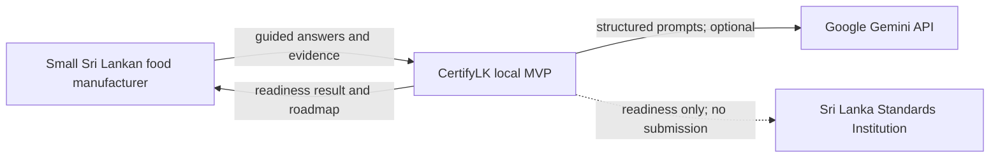
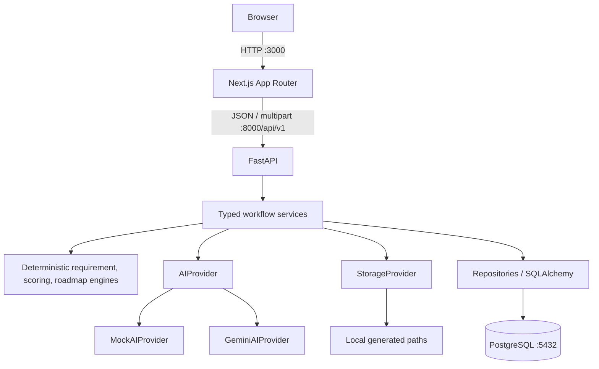
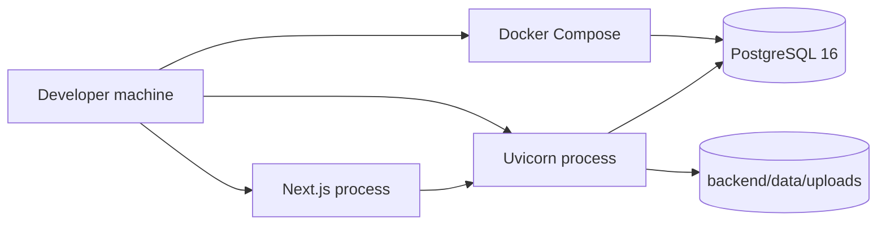

# Architecture

## System context

CertifyLK has no authentication or official SLS integration in Phase 1.

## Containers

## Page request flows

### Landing and Page 1

1. `POST /assessments` creates a UUID at `draft_profile`; the frontend stores it and opens `/profile`.
2. `PUT /profile` validates and stores profile answers, then advances to `profile_complete`.
3. `POST /adaptive-plan` creates profile-derived candidate questions, calls AI through validation/whitelisting, stores two to five questions, and returns them.
4. The frontend navigates to `/process`. Loading and API error states remain visible.

### Page 2

1. `PUT /process` requires the profile state, exactly five slots and at least three non-empty steps; it stores process/adaptive answers.
2. `POST /process-analysis` invokes `AIProvider.extract_process`, validates structured stages/tags, and stores the analysis.
3. `POST /evidence-plan` applies approved evidence types and limits (five photos, two PDFs), stores requests, advances to `evidence_pending`, and opens `/evidence`.

### Page 3

1. Multipart upload validates the request slot, MIME, extension, size, safe storage key, and slot count before storing metadata and bytes. Alternatively, `PUT /unavailable` closes a request without a file.
2. `POST /evidence-analysis` opens only stored files, sends sanitized evidence context to AI, validates observations/confidence, and persists them. Missing slots become unknown evidence, not gaps.
3. `POST /clarification-plan` builds high-priority candidates, enforces a three-to-five supplied-ID whitelist, persists them, advances to `clarification_pending`, and opens `/clarification`.

### Page 4 and result

1. `PUT /clarifications` validates answers against assigned questions and advances to `ready_to_score`.
2. `POST /complete` evaluates requirements and evidence references, calculates scores/completeness, maps/ranks catalogue actions, calculates LKR ranges and projected gains, and asks AI only for optional explanations. The transaction persists a completed result.
3. `GET /result` serializes the stored deterministic result. No provider call occurs on retrieval.

## AI adapter pattern

`AIProvider` is a protocol with five operations. `AIService` selects Mock or Gemini from backend settings, times calls, validates typed output, sanitizes free text, enforces supplied question/evidence whitelists, records `ai_runs`, retries Gemini once on invalid/transient output, and falls back only when explicitly allowed. Mock is deterministic and exercises the same schemas. AI never changes scores, prices, or requirement rules.

## Storage provider pattern

`StorageProvider` exposes generated-key save/open/delete operations. `LocalStorageProvider` resolves keys beneath the configured upload root and rejects traversal. `S3StorageProvider` is a typed future placeholder that deliberately raises a configuration error; it contains no AWS code. Database records store the generated key, never a raw user filename.

## Local infrastructure

Only PostgreSQL is containerized. This is local development infrastructure, not a production deployment.

## Security boundaries

- The browser is untrusted. All state transitions, assigned-question checks, file rules, and assessment ownership-by-UUID constraints are enforced server-side.
- `GEMINI_API_KEY`, database credentials, uploaded bytes, and raw extracted text remain behind FastAPI. Only `NEXT_PUBLIC_API_BASE_URL` reaches the browser.
- Uploaded content is untrusted data. It cannot change prompts, candidate IDs, requirements, costs, or tool behavior.
- Storage keys are UUID-based and path-confined; raw filenames are metadata only after control-character stripping and length limiting.
- Correlation IDs are accepted/generated and returned, but logs omit secrets and raw evidence content.
- CORS is restricted by backend environment configuration. No Phase 1 authentication means possession of a UUID allows local-session retrieval; public deployment needs a later privacy/security design.
