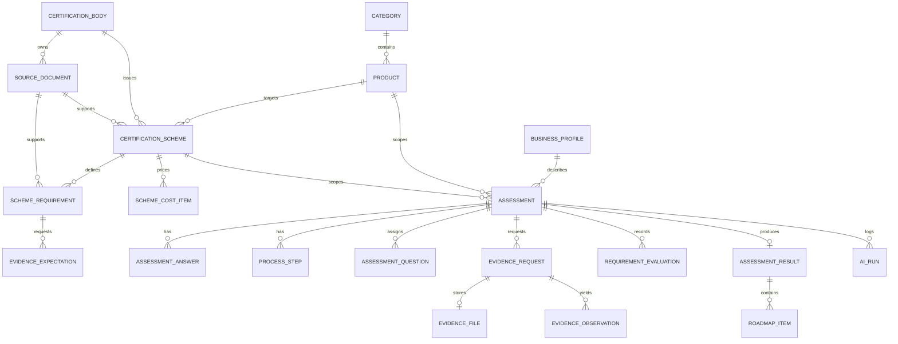

# Data model

PostgreSQL is the source of truth. UUIDs identify assessment-owned data; stable string IDs identify controlled catalogue data. JSON is used only for bounded, validated structures. Completed results snapshot the deterministic values shown to users.

## Current entities

### Certificate knowledge base

- **categories** — UUID, unique name/slug, description, enabled, display order.
- **products** — UUID, category FK, name/slug, description, enabled, display order.
- **certification_bodies** — stable ID, name/short code, website, description.
- **source_documents** — stable ID, owner body FK, title, version/effective date, URL or access reference, copyright note, reviewer/review date, verification flag, notes.
- **certification_schemes** — stable ID, name/short code, track (`product_quality`, `process_management`), body FK, nullable product FK, mandatory tier, applicability-rule JSON, category-weight JSON, standard version, effective date, source-document FK, catalogue revision, summary, timeline, source URL, active, display order.
- **scheme_requirements** — stable ID, scheme FK, category, title/description, Decimal weight, safety-critical flag, source document/source-document FK/clause/URL, `content_verified`, standard version, effective date, evaluation-rule JSON, order, active.
- **evidence_expectations** — stable ID, scheme FK, scheme-requirement FK, kind (`photo`, `document`, `lab_report`, `licence`, `declaration`), label, guidance, required flag, order, active.
- **scheme_cost_items** — stable ID, scheme FK, action reference/title, cost type, one-time and recurring LKR ranges, source note, effective date, last reviewed date.
- **business_profiles** — UUID, business name/type, years, scale, market list, existing-certification list, food-licence status, volume range, additional information, created time.

### Assessment workflow

- **assessments** — UUID, status/current page, sample flag, profile/process JSON, optional business-profile/product/scheme FKs, frozen scheme version, frozen catalogue revision, timestamps.
- **assessment_answers** — UUID, assessment FK, page/key/value JSON, timestamp; unique per assessment/page/key.
- **process_steps** — UUID, assessment FK, position 1–5, raw text, normalized stage/tags/confidence, timestamps.
- **question_bank** and **assessment_questions** — approved questions/options/tags/affected legacy requirement IDs and per-assessment assignments.
- **evidence_requests**, **evidence_files**, **evidence_observations** — requested type/kind/requirement references plus nullable controlled `self_assessment` (`yes`, `partial`, `no`, `not_sure`), generated storage metadata, and validated observation polarity/confidence plus exact successful `provider`, `fallback_used`, and `validation_status`. Self-assessment is persisted independently from optional file status. `evidence_observations.requirement_id` is an indexed displayed reference that can identify either a legacy or scheme requirement; it deliberately has no legacy-catalogue foreign key. Nullable `scheme_id` and `scheme_requirement_id` foreign keys provide certificate-specific grounding; legacy observations may leave both fields null.
- **requirements**, **recommendations**, **cost_items** — legacy global deterministic catalogue still used by the current scoring workflow.
- **requirement_evaluations** — statuses for legacy or scheme requirements. `requirement_id` stores the displayed requirement ID; `scheme_id` and `scheme_requirement_id` are populated for certificate-specific results.
- **assessment_results** — raw/display score, evidence completeness, category/result/cost snapshots, optional scheme/version/revision snapshot, and `roadmap_snapshot` for scheme-specific roadmap items.
- **roadmap_items** — legacy normalized roadmap rows for the global regression flow.
- **ai_runs** — optional assessment FK, operation, provider/model, latency, success, fallback, bounded error, created time. No prompt or raw evidence.

Assessment statuses currently implemented are `draft_profile`, `profile_complete`, `process_complete`, `evidence_pending`, `evidence_complete`, `clarification_pending`, `ready_to_score`, `completed`, and `failed`. Current pages are `profile`, `process`, `evidence`, `clarification`, and `result`.

## Transitional boundary

`scheme_requirements`/`scheme_cost_items` now power scheme-specific deterministic evaluation and roadmap snapshots when an assessment has `scheme_id`. `requirements`/`recommendations`/`cost_items` still power the legacy chilli-paste regression flow only. They are not interchangeable.

## Required target additions

The following remain planned:

- immutable retired-date lifecycle and historical version entities beyond the current frozen version/revision fields;
- reviewed import files for all catalogue facts;
- full question/evidence-submission cutover to `evidence_expectations`;
- explicit scheme binding on all question assignments and uploaded evidence files;
- recurring cost period beyond the current snapshot fields.

Every addition requires an Alembic migration and an update to this document.

## JSON fields

- `applicability_rule` contains deterministic supplied facts such as supported markets/scales and explanatory source notes.
- `category_weights` maps scheme category labels to published internal score weights.
- `evaluation_rule` is a controlled rule description interpreted only by deterministic code. SLS Cordial rows reuse the approved question keys/value bands and ordered-process derivation already present in the deterministic catalogue; requirements without an equivalent controlled rule remain evidence-only.
- market, certifications, options, tags, related IDs, evidence references, and result snapshots are bounded lists/objects validated at service boundaries.
- `assessments.profile_data.applicability_decision` currently stores decisions, overall reasoning, recommended scheme, exact provider/fallback, and run time.

## Indexes and integrity

Current indexes cover assessment status and catalogue/assessment foreign keys; unique constraints cover slugs and per-assessment positions/answers/evaluations. Target migrations must add efficient version/source/evidence-expectation lookups and prevent cross-scheme requirement references. Scheme category/requirement weights and cost min/max validity are additionally checked in deterministic seed/tests.

## Relationships

