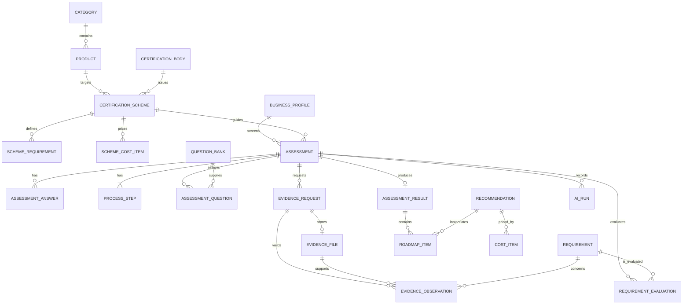

# Data model

PostgreSQL is the source of truth. Assessment-owned rows use UUID primary keys and foreign keys with delete cascades. Seed/catalogue entities use stable string IDs. Mutable tables include UTC `created_at` and `updated_at`; event-like rows include `created_at`.

## Entities

- **assessments** — UUID, status enum, current page, sample flag, structured profile/process-analysis JSON, nullable `business_profile_id` FK, `scheme_id` FK, `product_id` FK, timestamps. Statuses: `draft_profile`, `profile_complete`, `process_complete`, `evidence_pending`, `evidence_complete`, `clarification_pending`, `ready_to_score`, `completed`, `failed`.
- **business_profiles** — UUID, business name, business type, scale, market JSON list, existing certifications JSON list, food licence status, volume range, timestamps.
- **categories** — UUID, unique name, unique slug, description, enabled flag, display order.
- **products** — UUID, category UUID FK, name, unique slug, description, enabled flag, display order.
- **certification_bodies** — stable string ID (e.g. SLSI, CAA, ISO), name, unique short code, website URL, description.
- **certification_schemes** — stable string ID (e.g. SLS_MARK_CORDIAL), scheme name, short code, track enum (`product_quality`/`process_management`), certification body ID FK, product UUID FK (nullable), mandatory tier enum (`mandatory`, `market_required`, `recommended`, `optional`), applicability rule JSON, category weights JSON, summary, typical timeline days, active flag, display order.
- **scheme_requirements** — stable string ID, scheme ID FK, category label, title, description, weight decimal, safety critical flag, source document, clause reference, source URL, content verified flag, evaluation rule JSON, active flag, display order.
- **scheme_cost_items** — stable string ID, scheme ID FK, action ref, title, cost type enum (`certifying_body_fee`, `lab_testing_fee`, `business_capex`, `business_opex`), one-time min/max integer LKR, recurring min/max integer LKR, currency, source note, effective/reviewed dates.
- **assessment_answers** — UUID, assessment UUID, page (`profile`, `adaptive`, `clarification`), stable question/field key, value JSON, timestamp. Unique per assessment/page/key.
- **process_steps** — UUID, assessment UUID, position 1–5, text, normalized stage/tags/confidence, timestamps. Unique position per assessment.
- **question_bank** — stable ID, category, text, options JSON, allows Other, product/process tags JSON, affected requirement IDs JSON, priority, eligible page, active flag.
- **assessment_questions** — UUID, assessment UUID, question ID, page, display order, planning rationale, answered flag, timestamp. Unique assessment/page/question.
- **evidence_requests** — UUID, assessment UUID, allowed evidence type, kind (`photo`/`document`), title, related requirements JSON, status (`requested`, `uploaded`, `unavailable`, `analyzed`), display order, timestamps.
- **evidence_files** — UUID, request and assessment UUIDs, generated storage key, sanitized original name, MIME type, size, SHA-256, timestamp.
- **evidence_observations** — UUID, assessment/request/file UUIDs, requirement ID, polarity (`supports`, `concern`, `unclear`), bounded text, confidence decimal, provider, timestamp.
- **requirements** — stable ID, category, title, description, weight decimal, safety critical, applicability tags JSON, evaluation rule JSON, active flag.
- **recommendations** — stable ID, title, implementation steps JSON, related requirement IDs JSON, priority base, capex flag, cost note, review date, active flag.
- **cost_items** — stable ID, recommendation ID, one-time min/max and recurring min/max integer LKR, currency fixed to LKR, effective/reviewed dates.
- **requirement_evaluations** — UUID, assessment UUID, requirement ID, status (`confirmed`, `partial`, `gap`, `unknown`, `not_applicable`), multiplier decimal, evidence references JSON, rationale, timestamps. Unique assessment/requirement.
- **assessment_results** — UUID, assessment UUID unique, raw decimal and displayed score, evidence completeness, category score JSON, strengths/gaps/unknowns JSON snapshots, cost summary JSON, scoring version, timestamps.
- **roadmap_items** — UUID, result/assessment UUIDs, recommendation ID, order, priority tier, deterministic gains/raw projected score, catalogue cost snapshot JSON, AI/fallback explanation, timestamps.
- **ai_runs** — UUID, optional assessment UUID, operation, provider, model, latency, success, fallback flag, bounded error/validation message, timestamp. No prompt or raw content.

## JSON fields

All JSON fields are bounded application structures validated at service boundaries. Question options use `{value,label}` objects. Tags and related IDs are arrays of stable strings. Evidence references are strings such as `profile.production_record_frequency`, `answer.DOC_BATCH_01`, `process.3`, or `evidence:<observation UUID>`. Result/cost snapshots make completed results reproducible when catalogues later change.

## Indexes

Indexes cover `assessments.status`, `assessments.business_profile_id`, `assessments.scheme_id`, `assessments.product_id`, assessment foreign keys on all owned tables, `(assessment_id, created_at)` for events, question IDs, requirement IDs, evidence status, AI operation/created time, `categories.slug`, `products.slug`, `scheme_requirements.(scheme_id, display_order)`, and unique composite business keys described above.

## Relationships

